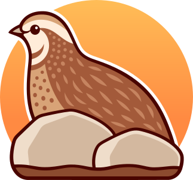

# Pāli Practice

A cross-platform Pāli language learning app designed to train noun declensions and verb conjugations with flashcards, using spaced repetition. Built with .NET and Uno Platform, so that it works on:

- Windows 7+
- macOS 10.15+ (Catalina)
- Linux ([.NET-supported distros](https://github.com/dotnet/core/blob/main/release-notes/10.0/supported-os.md#linux))
- Android 7+ (Nougat)
- iOS 15+ (iPhone & iPad)

This is work in progress, with the aim to be published on all the platforms.

## Setup

For initial and training database generation see:

**[Complete Setup Guide](scripts/SETUP.md)**

The setup involves:
1. Cloning with submodules (includes large corpus datasets)
2. Building the DPD database from source
3. Generating frequency data from text corpuses
4. Extracting training data for the app's database
5. Building and running the app

## Icon

The app's icon shows the quail from SN 47:6, the Sakuṇagghi Sutta ("The Hawk"), hiding behind rocks in its ancestral territory – a newly plowed field with clumps of earth all turned up.

> "Wander, monks, in what is your proper range, your own ancestral territory. In one who wanders in what is his proper range, his own ancestral territory, Māra gains no opening, Māra gains no foothold. And what, for a monk, is his proper range, his own ancestral territory? The four establishings of mindfulness."

You can read the full sutta here: https://www.dhammatalks.org/suttas/SN/SN47_6.html

Illustration by [Irina Mir](https://www.instagram.com/irmirx/)

## License

*Pāli Practice* builds on the hard work of the contributors to the [Digital Pāḷi Dictionary](https://digitalpalidictionary.github.io) which is included as a Git submodule in this project. To keep things simple, it is released under the same **CC BY-NC-SA 4.0** license as the *Digital Pāḷi Dictionary* itself.

- __CC__: You are free to free to __share__ and __adapt__ it
- __BY__: as long as you attribute the source,
- __NC__: don't use it commercially,
- __SA__: and share under the same conditions.

View the full license details on the [Creative Commons website](http://creativecommons.org/licenses/by-nc-sa/4.0/).

 

---

*Sabbe sattā sukhitā hontu – May all beings be happy* 🙏
